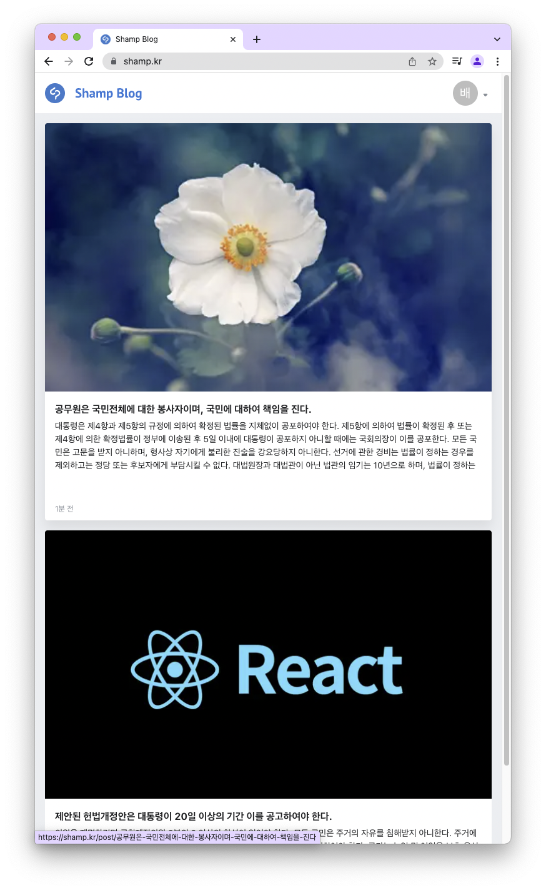

<div id="top"></div>
<!--
*** Thanks for checking out the Best-README-Template. If you have a suggestion
*** that would make this better, please fork the repo and create a pull request
*** or simply open an issue with the tag "enhancement".
*** Don't forget to give the project a star!
*** Thanks again! Now go create something AMAZING! :D
-->


<!-- PROJECT SHIELDS -->
<!--
*** I'm using markdown "reference style" links for readability.
*** Reference links are enclosed in brackets [ ] instead of parentheses ( ).
*** See the bottom of this document for the declaration of the reference variables
*** for contributors-url, forks-url, etc. This is an optional, concise syntax you may use.
*** https://www.markdownguide.org/basic-syntax/#reference-style-links
-->
[![Contributors][contributors-shield]][contributors-url]
[![Forks][forks-shield]][forks-url]
[![Stargazers][stars-shield]][stars-url]
[![Issues][issues-shield]][issues-url]
[![MIT License][license-shield]][license-url]


<!-- PROJECT LOGO -->
<br />
<div align="center">
  <a href="https://github.com/othneildrew/Best-README-Template">
    
  </a>

<h3 align="center">shamp-blog</h3>

  <p align="center">
    글을 작성하고 공유할 수 있는 나만의 블로그
    <br />
    <a href="https://shamp.kr"><strong>보러 가기 »</strong></a>
    <br />
    <br />
    <a href="https://github.com/Shamp07/shamp-blog/issues">버그 신고</a>
    ·
    <a href="https://github.com/Shamp07/shamp-blog/issues">기능 요청</a>
  </p>
</div>


<!-- TABLE OF CONTENTS -->
<details>
  <summary>목차</summary>
  <ol>
    <li>
      <a href="#about-the-project">프로젝트 정보</a>
      <ul>
        <li><a href="#built-with">기술 스택</a></li>
      </ul>
    </li>
    <li>
      <a href="#getting-started">시작하기</a>
      <ul>
        <li><a href="#prerequisites">전제조건</a></li>
        <li><a href="#installation">설치</a></li>
        <li><a href="#run">실행</a></li>
      </ul>
    </li>
    <li><a href="#usage">용도</a></li>
    <li><a href="#roadmap">로드맵</a></li>
    <li><a href="#contributing">기여하기</a></li>
    <li><a href="#license">라이센스</a></li>
    <li><a href="#contact">연락처</a></li>
    <li><a href="#acknowledgments">감사의 말</a></li>
  </ol>
</details>


<!-- ABOUT THE PROJECT -->
## 프로젝트 정보

<details>
  <summary>스크린샷</summary>
  <p align="center">
    
  </p> 
</details>

개발에 관련된 내용을 주력으로 작성해나가는 저만의 블로그입니다. 반응형 레이아웃이 적용되어 있으며 마크다운 기반([GFM](https://github.github.com/gfm/) 포함)으로 글이 작성됩니다.


계기:
* 단순히 기록용 게시글이 아닌 실제로 다른 개발자에게 도움이 될 수 있는 기록 플랫폼이 필요했습니다.
* 빠르게 변화하는 프론트엔드 기술 스택을 손쉽게 도입해보고 도전해볼 수 있는 나만의 프로젝트가 필요했습니다.  
* 나만의 게시글을 양질로 작성함으로 나를 어필하고 마케팅하고 싶었습니다.
* 개발에 관련된 글을 꾸준히 작성함으로써 자연스럽게 기술 스택의 트렌트를 쫓고 누구에게나 읽기 쉬우며 이해하기 쉬운 글을 작성할 수 있는 능력을 기르고 싶었습니다. 

<p align="right">(<a href="#top">back to top</a>)</p>


### 기술 스택

* [TypeScript](https://www.typescriptlang.org/)
* [React.js](https://reactjs.org/)
* [Next.js](https://nextjs.org/)
* [MobX.js](https://mobx.js.org/)
* [Emotion](https://emotion.sh/)


<p align="right">(<a href="#top">back to top</a>)</p>


<!-- GETTING STARTED -->
## 시작하기

**비공개 환경 파일 및 고려할 것이 많으므로 아직 로컬에 대한 환경이 제대로 준비되지 않았습니다.**

### 전제조건

해당 프로젝트는 아래 버전과 같은 환경에서 개발되었습니다. 동일한 환경에서 실행하는 것을 권장합니다. 
* Node (https://github.com/nvm-sh/nvm#installing-and-updating)
  ```sh
  nvm install 16.13.2
  ```

* NPM
  ```sh
  npm install npm@6.14.16
  ```

### 설치

_Below is an example of how you can instruct your audience on installing and setting up your app. This template doesn't rely on any external dependencies or services._

1. 레파지토리를 클론합니다.
   ```sh
   git clone https://github.com/Shamp07/shamp-blog.git
   ```
2. NPM 패키지들을 설치합니다.
   ```sh
   npm install
   ```
3. 아래와 같은 환경파일을 경로에 맞게 설정합니다. (준비 중)
   
### 실행
  ```sh
  npm run dev
  ```

<p align="right">(<a href="#top">back to top</a>)</p>


<!-- USAGE EXAMPLES -->
## 용도

직접 글을 작성하여 여러 개발자들한테 

<p align="right">(<a href="#top">back to top</a>)</p>


<!-- ROADMAP -->
## 로드맵

- [ ] CI/CD 구축
- [ ] S3 Bucket 웹 호스팅 및 CloudFront 배포
- [ ] 영어 언어 지원
- [ ] 기여할 수 있는 로컬 환경 지원

제안된 기능(및 알려진 문제)의 전체 목록을 보려면 [열린 이슈](https://github.com/Shamp07/shamp-blog) 를 참조하십시오.


<p align="right">(<a href="#top">back to top</a>)</p>


<!-- CONTRIBUTING -->
## 기여하기

Contributions are what make the open source community such an amazing place to learn, inspire, and create. Any contributions you make are **greatly appreciated**.

If you have a suggestion that would make this better, please fork the repo and create a pull request. You can also simply open an issue with the tag "enhancement".
Don't forget to give the project a star! Thanks again!

1. 레파지토리를 포크해주세요.
2. Create your Feature Branch (`git checkout -b feature/AmazingFeature`)
3. Commit your Changes (`git commit -m 'Add some AmazingFeature'`)
4. Push to the Branch (`git push origin feature/AmazingFeature`)
5. Open a Pull Request

<p align="right">(<a href="#top">back to top</a>)</p>


<!-- LICENSE -->
## 라이센스

Distributed under the MIT License. See `LICENSE.txt` for more information.

<p align="right">(<a href="#top">back to top</a>)</p>


<!-- CONTACT -->
##연락처

blog.shamp@gmail.com

<p align="right">(<a href="#top">back to top</a>)</p>


<!-- ACKNOWLEDGMENTS -->
## 감사의 말

* [Font Awesome](https://fontawesome.com)
* [Best-README-Template](https://github.com/othneildrew/Best-README-Template)
* [tui.editor](https://ui.toast.com/tui-editor)

<p align="right">(<a href="#top">back to top</a>)</p>


<!-- MARKDOWN LINKS & IMAGES -->
<!-- https://www.markdownguide.org/basic-syntax/#reference-style-links -->
[contributors-shield]: https://img.shields.io/github/contributors/Shamp07/shamp-blog.svg?style=for-the-badge
[contributors-url]: https://github.com/Shamp07/shamp-blog/graphs/contributors
[forks-shield]: https://img.shields.io/github/forks/Shamp07/shamp-blog.svg?style=for-the-badge
[forks-url]: https://github.com/Shamp07/shamp-blog/network/members
[stars-shield]: https://img.shields.io/github/stars/Shamp07/shamp-blog.svg?style=for-the-badge
[stars-url]: https://github.com/Shamp07/shamp-blog/stargazers
[issues-shield]: https://img.shields.io/github/issues/Shamp07/shamp-blog.svg?style=for-the-badge
[issues-url]: https://github.com/Shamp07/shamp-blog/issues
[license-shield]: https://img.shields.io/github/license/Shamp07/shamp-blog.svg?style=for-the-badge
[license-url]: https://github.com/Shamp07/shamp-blog/blob/master/LICENSE.txt
[product-screenshot]: assets/image/preview.png
